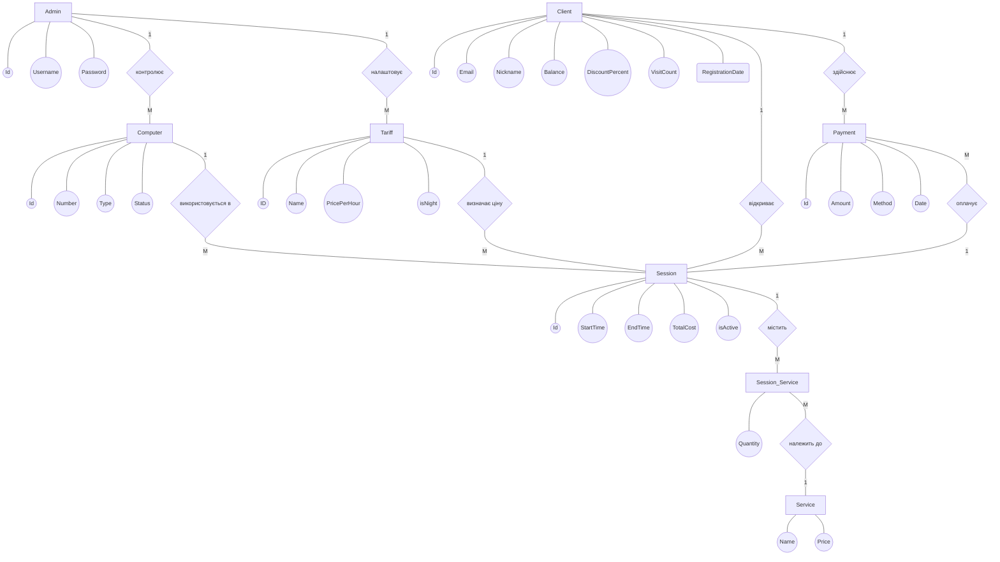
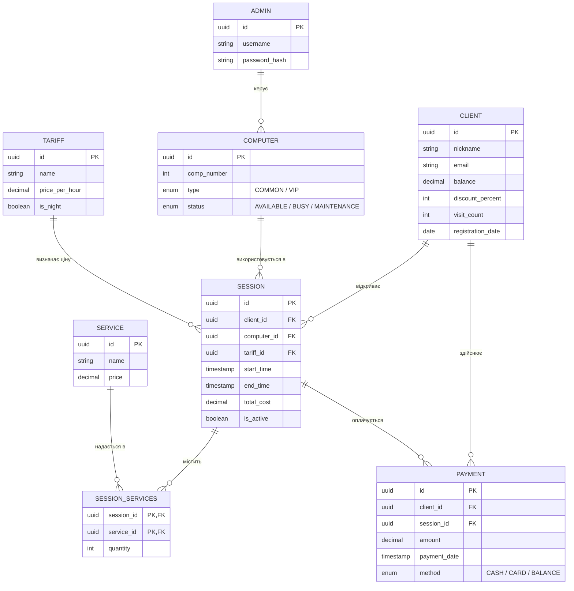

# Схеми БД для Комп'ютерного клубу

## 1.Концептуальна схема (Нотація Пітера Чена)

```mermaid
graph TD
    ADMIN[Admin]
    CLIENT[Client]
    COMPUTER[Computer]
    SESSION[Session]
    TARIFF[Tariff]
    SERVICE[Service]
    PAYMENT[Payment]
    S_SERVICE[Session_Service]

    CONTROL{контролює}
    SETUP{налаштовує}
    OPENS{відкриває}
    USES{використовується в}
    DETERMINES{визначає ціну}
    MAKES{здійснює}
    PAYS_FOR{оплачує}
    INCLUDES{містить}
    BELONGS{належить до}

    ADMIN --- A1((Id))
    ADMIN --- A2((Username))
    ADMIN --- A3((Password))
    
    CLIENT --- C1((Id))
    CLIENT --- C2((Email))
    CLIENT --- C3((Nickname))
    CLIENT --- C4((Balance))
    CLIENT --- C5((DiscountPercent))
    CLIENT --- C6((VisitCount))
    CLIENT --- C7(RegistrationDate)

    TARIFF --- T1((ID))
    TARIFF --- T2((Name))
    TARIFF --- T3((PricePerHour))
    TARIFF --- T4((isNight))
    
    COMPUTER --- COM1((Id))
    COMPUTER --- COM2((Number))
    COMPUTER --- COM3((Type))
    COMPUTER --- COM4((Status))
    
    SESSION --- S1((Id))
    SESSION --- S2((StartTime))
    SESSION --- S3((EndTime))
    SESSION --- S4((TotalCost))
    SESSION --- S5((isActive))
    
    PAYMENT --- P1((Id))
    PAYMENT --- P2((Amount))
    PAYMENT --- P3((Method))
    PAYMENT --- P4((Date))

    S_SERVICE --- SS1((Quantity))

    SERVICE --- SR1((Name))
    SERVICE --- SR2((Price))

    ADMIN -- 1 --- CONTROL
    CONTROL -- M --- COMPUTER
    
    ADMIN -- 1 --- SETUP
    SETUP -- M --- TARIFF

    CLIENT -- 1 --- OPENS
    OPENS -- M --- SESSION
    
    COMPUTER -- 1 --- USES
    USES -- M --- SESSION
    
    TARIFF -- 1 --- DETERMINES
    DETERMINES -- M --- SESSION

    CLIENT -- 1 --- MAKES
    MAKES -- M --- PAYMENT
    
    PAYMENT -- M --- PAYS_FOR
    PAYS_FOR -- 1 --- SESSION

    SESSION -- 1 --- INCLUDES
    INCLUDES -- M --- S_SERVICE
    S_SERVICE -- M --- BELONGS
    BELONGS -- 1 --- SERVICE
```

## 2.Логічна схема (Нотація Crow's Foot)

```mermaid
erDiagram
    ADMIN {
        uuid id PK
        string username
        string password_hash
    }

    CLIENT {
        uuid id PK
        string nickname
        string email
        decimal balance
        int discount_percent
        int visit_count
        date registration_date
    }

    COMPUTER {
        uuid id PK
        int comp_number
        enum type "COMMON / VIP"
        enum status "AVAILABLE / BUSY / MAINTENANCE"
    }

    TARIFF {
        uuid id PK
        string name
        decimal price_per_hour
        boolean is_night
    }

    SESSION {
        uuid id PK
        uuid client_id FK
        uuid computer_id FK
        uuid tariff_id FK
        timestamp start_time
        timestamp end_time
        decimal total_cost
        boolean is_active
    }

    SERVICE {
        uuid id PK
        string name
        decimal price
    }

    SESSION_SERVICES {
        uuid session_id PK, FK
        uuid service_id PK, FK
        int quantity
    }

    PAYMENT {
        uuid id PK
        uuid client_id FK
        uuid session_id FK
        decimal amount
        timestamp payment_date
        enum method "CASH / CARD / BALANCE"
    }

    ADMIN ||--o{ COMPUTER : "керує"
    CLIENT ||--o{ SESSION : "відкриває"
    CLIENT ||--o{ PAYMENT : "здійснює"
    COMPUTER ||--o{ SESSION : "використовується в"
    TARIFF ||--o{ SESSION : "визначає ціну"
    SESSION ||--o{ SESSION_SERVICES : "містить"
    SERVICE ||--o{ SESSION_SERVICES : "надається в"
    SESSION ||--o{ PAYMENT : "оплачується"
```
